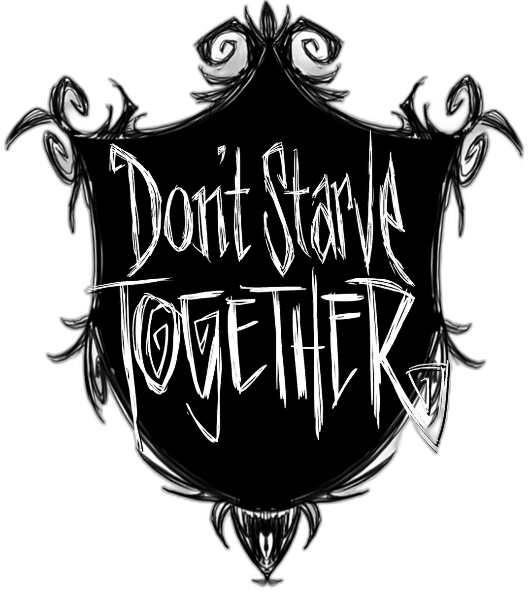

# </a> Don't Starve Together - Descubra seu dano

## 💻 Resumo
### Programa em code line para calcular potencial de dano de cada personagem com cada arma diferente

Observações: O arquivo "Descubra seu dano 2.0.py" está reduzido e diferente da última versão em codeline ("Descubra seu dano 1.2.7.py") pois o 2.0 é a primeira versão com GUI, então ainda estou adaptando o código à POO e implementando a GUI e algumas funcionalidades extras.

UPDATE: Finalizado a primeira versão funcional do programa com interface gráfica, denominada como "Descubra seu dano 2.0.6.py". Aplicado alguns conceitos de recursividade, herança, associação e composição.

### ✔ Downloads

[Calculadora de Dano - DST](https://www.mediafire.com/file/l7da3u7op7d3arb/DescubraSeuDano.rar/file)

## 📚 Documentação
-[Python](https://docs.python.org/3/)

-[CustomTkinter](https://customtkinter.tomschimansky.com/documentation/)

-[Pillow(PIL Fork)](https://pillow.readthedocs.io/en/stable/)

-[Webbrowser](https://docs.python.org/3/library/webbrowser.html)

## 🔎 Referências
-[Don't Starve Together Fandom Wiki](https://dontstarve.fandom.com/wiki/Don%27t_Starve_Together)
